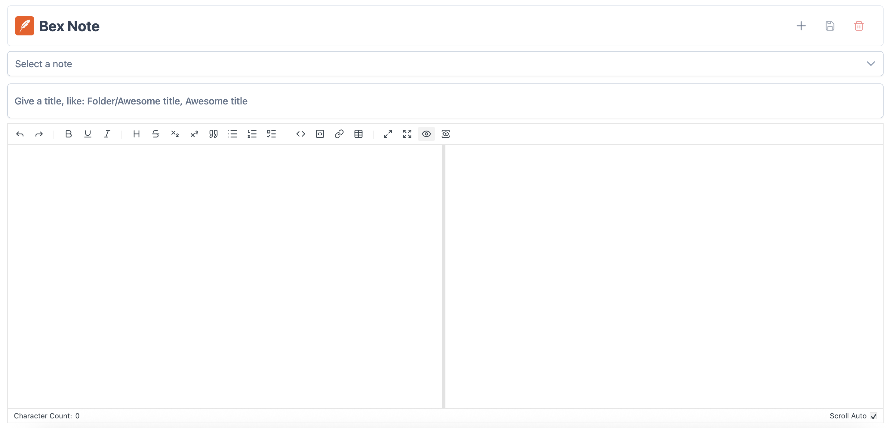

# Bex Note

Bex Note is a simple note‑taking web application built with Vue and Express.

Key features include:
- Web based
- Stores notes in local files (no database required)
- Very lightweight
- Supports multi-level folder structure (folder1/folder2/note)
- Markdown support

## Installation
- Docker Hub: [bex1111/bex-note](https://hub.docker.com/r/bex1111/bex-note)  
- [Example `docker-compose.yml` file.](https://github.com/bex1111/bex-note/blob/main/docker-compose.yml)

> [!WARNING]  
> **Highly recommended:** Use a reverse proxy (such as Nginx or Caddy) with SSL/TLS enabled to securely access Bex Note.