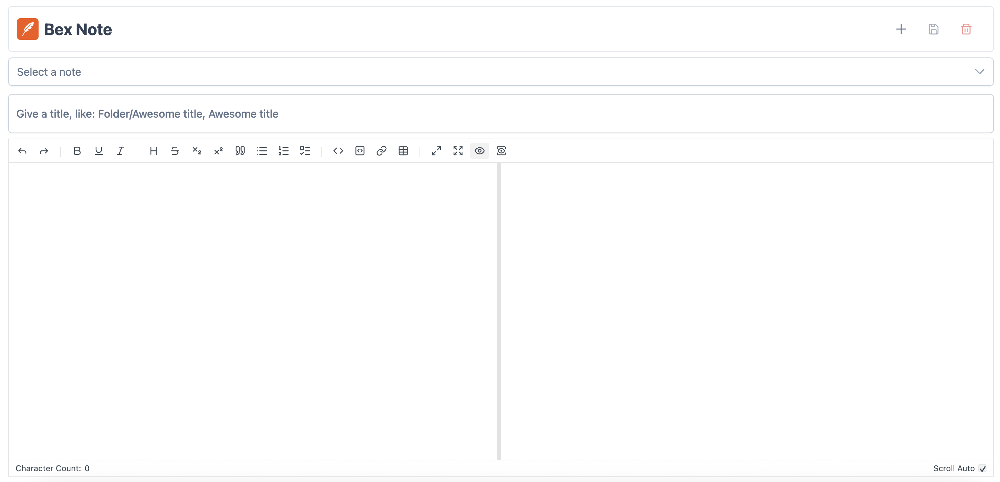
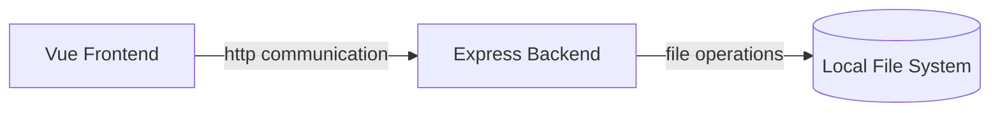

# Bex Note

Bex Note is a simple note‑taking web application. Web interface built with Vue. Express (node js) backend handle file
operations and
authentication.

Key features include:

- Web based
- Stores notes in local files (no database required)
- Very lightweight
- Supports multi-level folder structure (folder1/folder2/note)
- Markdown support (pure text, no image supported)

## Installation

- Docker Hub: [bex1111/bex-note](https://hub.docker.com/r/bex1111/bex-note)
- [Example `docker-compose.yml` file.](https://github.com/bex1111/bex-note/blob/main/docker-compose.yml)

> [!TIP]  
> **Highly recommended:** Use a reverse proxy (such as Nginx or Caddy) with SSL/TLS enabled to securely access Bex Note.

## Backup

Bex Note stores notes in the `data` directory. To back up your notes, simply backup this directory.

## High level architecture

```mermaid
flowchart LR
    Frontend[Vue Frontend] -->|http communication| Backend[Express Backend]
    Backend -->|file operations| LocalFileSystem[(Local File System)]
```

# Development

> [!NOTE]
> AI was used in the development of this project.

